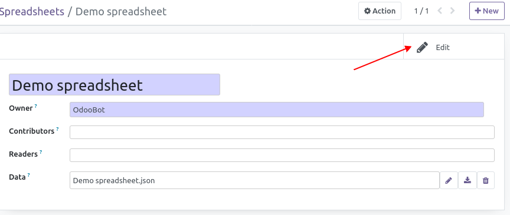
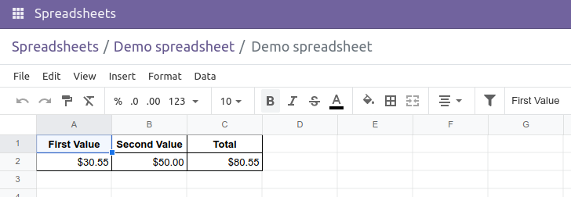
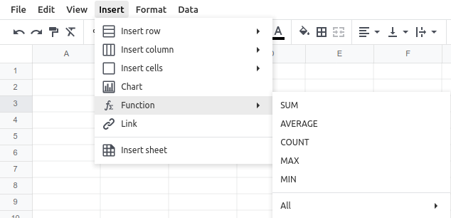

## **Create a new spreadsheet**

- Go to 'Spreadsheet' menu
- Click on 'Create'
- Put a name, then click on the "Edit" button

- At this point you switch to spreadsheet editing mode. The editor is
  named `o-spreadsheet` and looks like another common spreadsheet web
  editors. (OnlyOffice, Ethercalc, Google Sheets (non-free)).

- You can use common functions `SUM()`, `AVERAGE()`, etc. in the cells.
  For a complete list of functions and their syntax, Refer to the
  documentation <https://github.com/odoo/o-spreadsheet/> or go to
  <https://odoo.github.io/o-spreadsheet/> and click on "Insert \>
  Function".

- Note: Business Odoo module can add "business functions". This is
  currently the case for the accounting module, which adds the following
  features:

  > - `ODOO.CREDIT(account_codes, date_range)`: Get the total credit for
  >   the specified account(s) and period.
  > - `ODOO.DEBIT(account_codes, date_range)`: Get the total debit for
  >   the specified account(s) and period.
  > - `ODOO.BALANCE(account_codes, date_range)`: Get the total balance
  >   for the specified account(s) and period.
  > - `ODOO.FISCALYEAR.START(day)`: Returns the starting date of the
  >   fiscal year encompassing the provided date.
  > - `ODOO.FISCALYEAR.END(day)`: Returns the ending date of the fiscal
  >   year encompassing the provided date.
  > - `ODOO.ACCOUNT.GROUP(type)`: Returns the account ids of a given
  >   group where type should be a value of the `account_type` field of
  >   `account.account` model. (`income`, `asset_receivable`, etc.)

## **Create a new dynamic spreadsheet from pivot**

- Go to any pivot
- Press on insert button
- Select the dynamic rows or dynamic columns option and set a number of
  rows/columns

A new table that will be updated with the actual or filtered values will
be added.

- Note: When a pivot has multiple levels of aggrupations in the rows or
  the columns, the number of rows/columns selected will be transfered to
  each level.

  Example: number of groups -\> 2 number of rows -\> 3

  - val1
    - subval1.1
    - subval1.2
    - subval1.3
  - val2
    - subval2.1
    - subval2.2
    - subval2.3
  - val3
    - subval3.1
    - subval3.2
    - subval3.3

Here is a visual exaple of use: .. figure::
../static/description/spreadsheet_dynamic_table.gif
